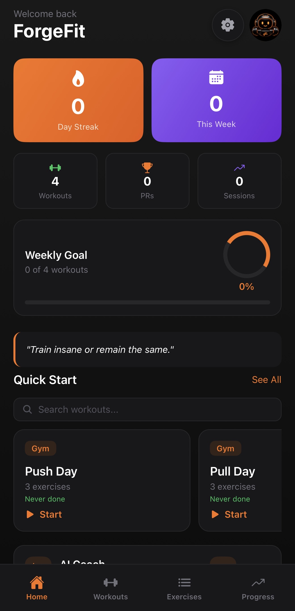
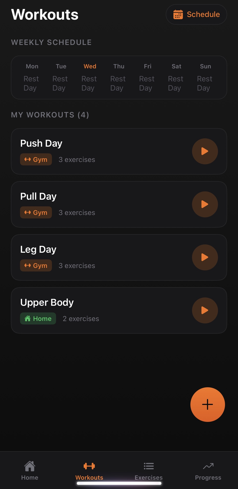
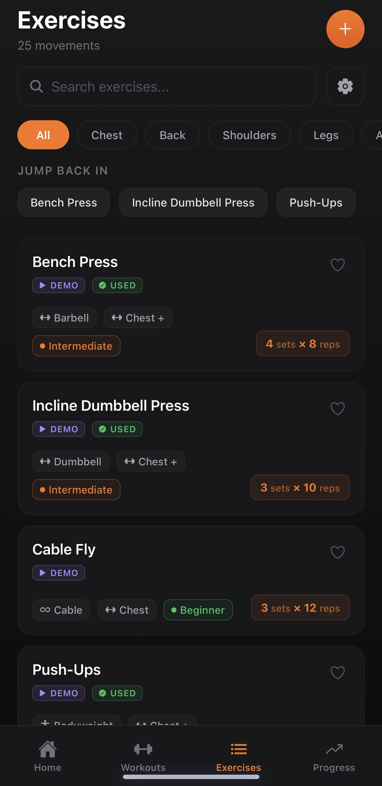
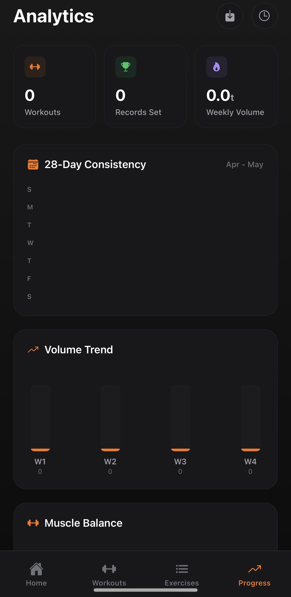
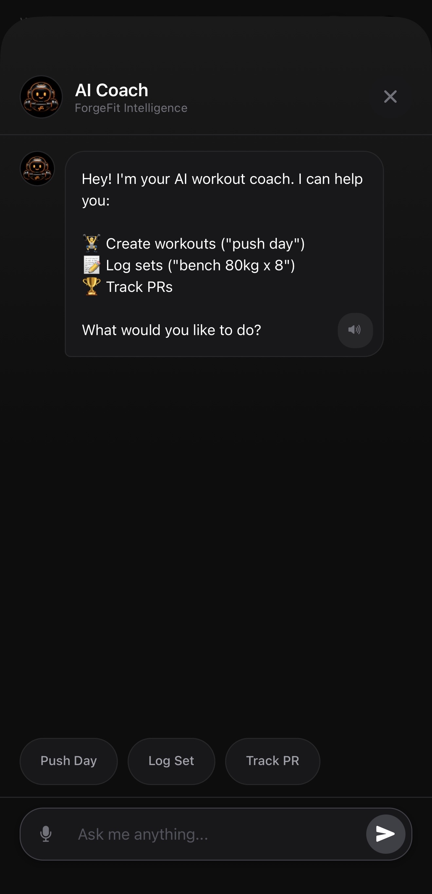
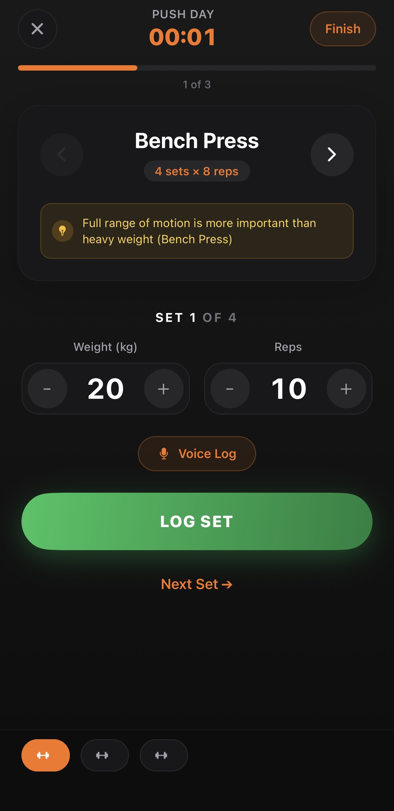
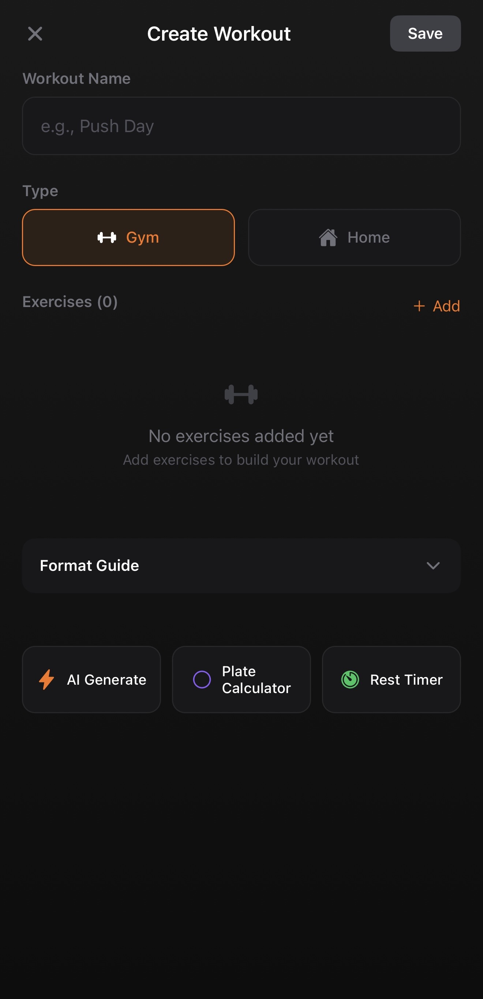
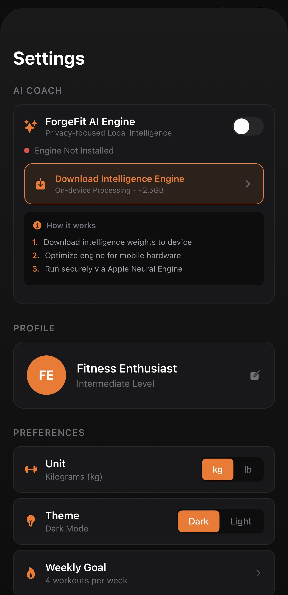

<!-- ForgeFit - Premium Workout Tracker App -->

<div align="center">


<h1>
  <span style="color: #F97316;">Forge</span><span style="color: #fff;">Fit</span>
</h1>

> The ultimate AI-powered workout tracker for serious fitness enthusiasts

<p align="center">

[](https://expo.dev)
[](https://expo.dev)
[](LICENSE)
[](app.json)

</p>

**[Explore the App](#features)** · **[Installation](#installation)** · **[Screenshots](#screenshots)** · **[Tech Stack](#tech-stack)** · **[Contributing](#contributing)**

</div>

---

## Why ForgeFit?

ForgeFit isn't just another workout tracker—it's your personal AI-powered fitness companion built for **real gym-goers** who demand speed, simplicity, and results.

**What Sets Us Apart:**

- ⚡ **Lightning-Fast Logging** - Log sets with just 3 taps. Fully optimized list rendering with zero frame drops.
- 🤖 **AI Coach** - Natural language commands: "Create a chest day" or "Log bench press 80kg 8 reps"
- 🔥 **Smart Rest Timer** - Background-resilient absolute timers that never drift, even when you switch apps.
- 💪 **Supersets & Circuits** - Build advanced workout templates with linked exercises.
- 📊 **Progress That Matters** - PR tracking, volume analytics, and muscle balance calculations.
- 🔄 **Production-Grade SQLite** - Fully normalized, local-first database handling high-speed data persistence offline.

---

## Features

| Feature | Description |
|---------|-------------|
| 🤖 **AI Coach** | Chat to create workouts, log sets, track PRs, get workout suggestions |
| 🏋️ **Live Workout Tracking** | Real-time timer, set logging, rest alerts, exercise navigation |
| 📝 **Workout Builder** | Create gym/home workouts with supersets, circuits, AMRAP, EMOM |
| 📚 **Exercise Library** | 25+ exercises searchable by muscle group with custom additions |
| 📈 **Progress Analytics** | 28-day heatmap, PR board, volume charts, muscle balance |
| 📅 **Weekly Schedule** | Plan your week with scheduled workouts |
| ⚙️ **Settings** | Unit toggle (kg/lb), goals, experience level |

---

## Screenshots

<div align="center">

| Home Dashboard | Workouts | Exercise Library | Progress |
|:---:|:---:|:---:|:---:|
|  |  |  |  |

| AI Coach | Live Workout | Workout Builder | Settings |
|:---:|:---:|:---:|:---:|
|  |  |  |  |

</div>

---

## Installation

```bash
# Clone the repository
git clone https://github.com/achyuthkp27/forge-fit.git
cd forge-fit

# Install dependencies
npm install

# Build the development version on the iOS Simulator
npx expo run:ios

# Build the optimized production release on a connected iPhone
npx expo run:ios --configuration Release --device
```

**Requirements:**
- Node.js 18+
- Xcode 15+ (for iOS)
- macOS (iOS development)
- Apple Developer Account (for installing on a physical device)

---

## Tech Stack

<div align="center">

| Layer | Technology |
|:---:|:---|
| **Framework** | [React Native](https://reactnative.dev/) + [Expo SDK 52](https://expo.dev/) |
| **Navigation** | [Expo Router v4](https://expo.dev/router) |
| **State** | [Zustand](https://zustand-demo.pmnd.rs/) |
| **Database** | [expo-sqlite](https://docs.expo.dev/versions/latest/sdk/sqlite/) |
| **UI** | [React Native](https://reactnative.dev/) + Linear Gradients |
| **Icons** | [@expo/vector-icons](https://docs.expo.dev/versions/latest/sdk/vector-icons/) |

</div>

---

## Project Structure

```
forge-fit/
├── app/                    # Expo Router screens
│   ├── (tabs)/            # Tab navigation
│   │   ├── index.tsx      # Home dashboard & Heatmaps
│   │   ├── workouts.tsx   # Workout list & schedule
│   │   ├── exercises.tsx  # Optimized Exercise library
│   │   └── progress.tsx   # Analytics & PR tracking
│   ├── chat.tsx           # AI Coach Interface
│   ├── workout.tsx        # Live workout session (Background resilient)
│   ├── workout-builder.tsx# Create workouts & supersets
│   ├── schedule.tsx       # Weekly planner
│   └── settings.tsx       # App settings & Theme Engine
├── stores/
│   └── workoutStore.ts   # Zustand state management
├── lib/
│   ├── db.ts             # Normalized SQLite database schema
│   └── aiService.ts      # LLM / RAG integration layer
├── components/            # Modular UI components (Modals, Buttons)
├── types/                 # Strict TypeScript definitions
└── assets/                # Images & icons
```

---

## Contributing

We welcome contributions! Here's how you can help:

1. **Fork** the repository
2. **Create** a feature branch (`git checkout -b feature/amazing-feature`)
3. **Commit** your changes (`git commit -m 'Add amazing feature'`)
4. **Push** to the branch (`git push origin feature/amazing-feature`)
5. **Open** a Pull Request

---

## License

This project is licensed under the **MIT License** - see the [LICENSE](LICENSE) file for details.

---

## Acknowledgments

- [Expo](https://expo.dev/) for the amazing development experience
- [React Native](https://reactnative.dev/) for cross-platform power
- [Zustand](https://zustand-demo.pmnd.rs/) for simple state management

---

<div align="center">

**Made with ❤️ by [Achyuth KP](https://github.com/achyuthkp27)**

[](https://github.com/achyuthkp27/forge-fit)
[](https://github.com/achyuthkp27/forge-fit)

[Back to Top](#forgefit---premium-workout-tracker-app)

</div>